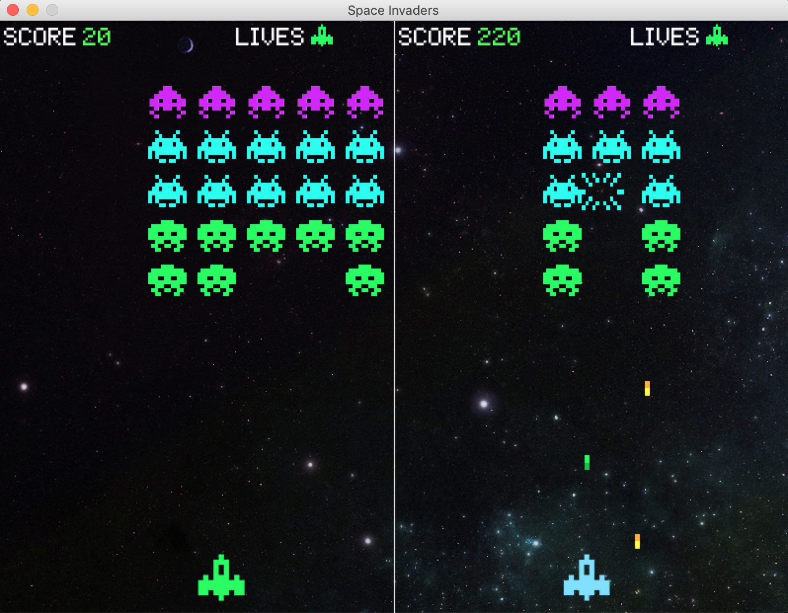

# Space Invaders

## About

This is a 2-playered version of the game classic Atari game Space Invaders, where a human player plays with an AI.  

Uses:

'python3 spaceinvaders.py' for default with noncooperative agent   
'python3 spaceinvaders.py p' for practice round with no AI   
'python3 spaceinvaders.py c' for play with cooperative agent   

Credit to Atari games for making the original "Space Invaders" and credit to Lee Robinson(https://leerob.io/blog/space-invaders-with-python), who created the original code that I built on to make this spinoff.

Thank you to Professor Marynel Vazquez for advising me in the process of making this game.

